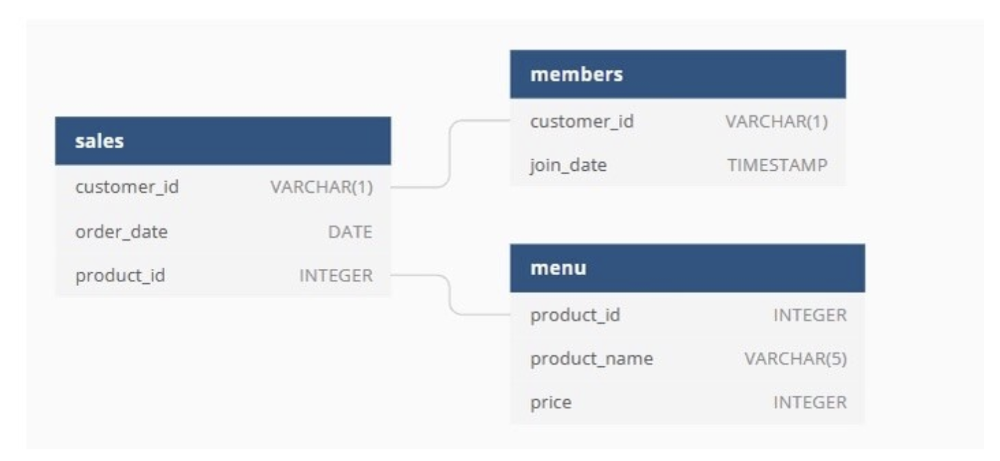

# Analyze data with PySpark

This project will show you how to use PySpark to analyze data.



# How to replicate this project?

1. Clone this repo with `git clone`.
2. Create a virtual environment and activate it (I use `venv`: check [here](https://docs.python.org/3/library/venv.html) how to do it)
3. Install the requirements in `requirements.txt` with `pip install -r requirements.txt`.
4. Play with the `analyze_data_apache_spark.ipynb`

## Others

If you want to quick overview, I'll recommend you read my [Medium article](https://medium.com/@andresf.mesad/analyze-data-with-pyspark-ae6ea91584fe).

Sometimes it's pretty difficul to install PySpark ion local, so you can use Databricks because there everything will be in place and you won't have to worry about the Cluster, nodes or any configuration.

[Here](https://databricks-prod-cloudfront.cloud.databricks.com/public/4027ec902e239c93eaaa8714f173bcfc/269241463296902/3213733448712832/4532987408519436/latest.html) you'll find my Databrick's Notebook.

Folder structure:

```
├── README.md
├── analyze_data_apache_spark.ipynb
├── data
│   ├── members.csv
│   ├── menu.csv
│   └── sales.csv
└── pizza_danny.png
```
